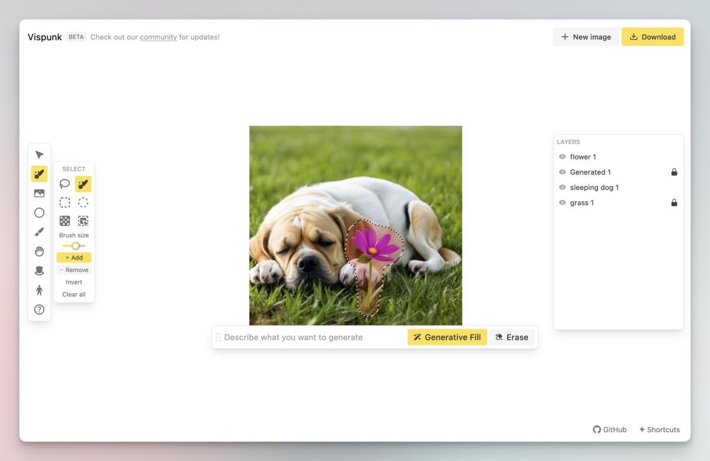

<h1 align="center"><b>Vispunk</b></h1>

  The image-first alternative for generative AI image workflows
     
    <a href="https://vispunk.com"><strong>Check it out now</strong></a>
  

We are in the middle of cleaning up the code for open-source release, and we estimate this to be released within the next 2 weeks.

In the meantime, check out [our subreddit](https://reddit.com/r/vispunk/) for updates!

  
   
   
  
  
  
   

---

## Features

- [x] Image-based + text-based generation based on Stable Diffusion
- [x] Canvas-based + layer-based UI built on [fabric.js](https://fabricjs.com)
- [x] Generative Fill based on Stable Diffusion inpainting
- [x] Magic Erase
- [x] Background Removal
- [x] Object Select
- [x] Magic Assets + Magic Pose - unlimited PNG stock images
- [x] Other traditional tools including lasso select, layer grouping, shapes and text insertion

## Like what you're seeing?

Support us by [joining our subreddit](https://reddit.com/vispunk), and letting us know your feedback on our [public beta](https://vispunk.com)!
